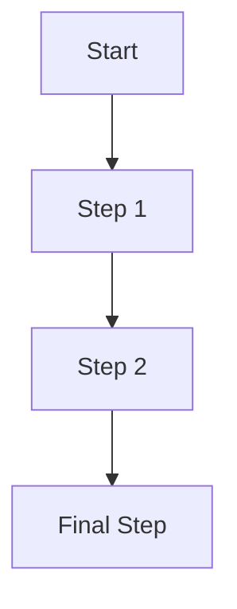

<v-clicks>

  <!-- First Diagram -->
  
= 0 ? 'crossfade-chart active' : 'crossfade-chart']">
    <v-clicks>

    </v-clicks>
  

  <!-- Second Diagram -->
  
= 1 ? 'crossfade-chart active' : 'crossfade-chart']">
    <v-clicks>

    </v-clicks>
  

</v-clicks>
