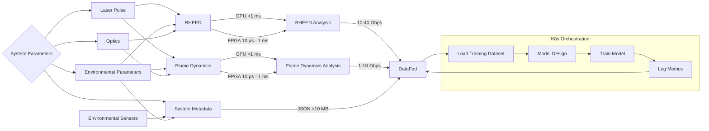

```mermaid {theme: 'neutral', scale: 0.3}
graph LR
systemparameters{System Parameters} --> SystemMetadata[System Metadata]
systemparameters --> LaserPulse[Laser Pulse]
systemparameters --> Environmental[Environmental Parameters]
systemparameters --> Optics[Optics]

LaserPulse --> RHEED[RHEED]
LaserPulse --> PlumeDynamics[Plume Dynamics]
Environmental --> PlumeDynamics[Plume Dynamics]
Environmental --> RHEED[RHEED]
EnvironmentalSensors[Environmental Sensors] --> SystemMetadata[System Metadata]
Optics --> RHEED[RHEED]
Optics --> PlumeDynamics[Plume Dynamics]

Environmental --> SystemMetadata[System Metadata]

RHEED --> |GPU >1 ms| RHEEDAnalysis[RHEED Analysis]
RHEED --> |FPGA 10 μs - 1 ms| RHEEDAnalysis[RHEED Analysis]
PlumeDynamics --> |GPU >1 ms| PlumeDynamicsAnalysis[Plume Dynamics Analysis]
PlumeDynamics --> |FPGA 10 μs - 1 ms| PlumeDynamicsAnalysis[Plume Dynamics Analysis]

RHEEDAnalysis --> |10-40 Gbps| ScientificDataManagement[DataFed]
PlumeDynamicsAnalysis --> |1-10 Gbps| ScientificDataManagement[DataFed]
SystemMetadata --> |JSON <10 MB| ScientificDataManagement[DataFed]

ScientificDataManagement --> LoadTrainingDataset

subgraph K8s_Model_Training["K8s Orchestration"]
    LoadTrainingDataset[Load Training Dataset]
    ModelDesign[Model Design]
    TrainModel[Train Model]
    LogMetrics[Log Metrics]
    LoadTrainingDataset --> ModelDesign --> TrainModel --> LogMetrics
end

LogMetrics --> ScientificDataManagement[DataFed]
```

